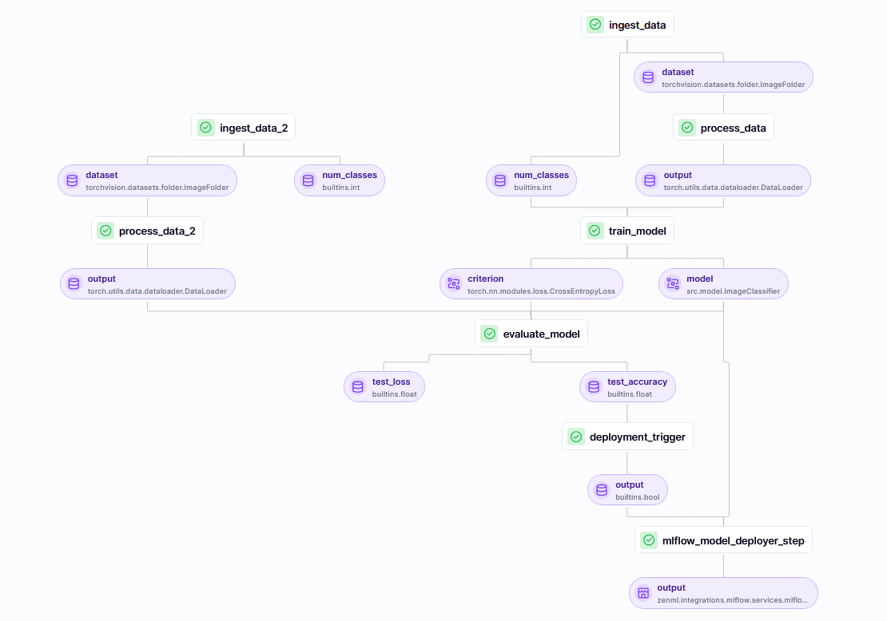

# 🖼️ Image Classification with PyTorch | MLOps using ZenML
This work implements a Machine Learning (ML) workflow and deployment for an image classification model built using PyTorch and trained on CIFAR-100 dataset. The project implements a complete MLOps workflow with **ZenML** for orchestration, **Streamlit** for UI, **FastAPI** for backend services, and connects to a deployed model on an MLOps server for inference. The goal is to demonstrate how to integrate machine learning pipelines with MLOps tools and serve a deep learning model using a modern full-stack setup.

# 🛠️ Technologies Used
- **PyTorch**: Deep learning framework for building the CNN model for classification.
- **ZenML**: MLOps framework for creating reproducible ML pipelines.
- **MLFlow**: For model logging and tracking (integrated via ZenML).
- **FastAPI**: Backend API service for handling inference requests.
- **Streamlit**: Frontend interface for user interactions.
- **Conda**: Used to manage the project’s virtual environment and dependencies.

## 🎯 Project Overview



The implemented Machine Learning workflow consists of several key stages:
1. **Data Ingestion**: Load and preprocess (apply transformations) the CIFAR-100 dataset.
2. **DataLoader**: Fetch loader objects for ingested and processed data.
3. **Model Training**: Train a convolutional neural network (CNN) on the training dataset.
4. **Model Evaluation**: Evaluate the performance of the model on the training dataset.
6. **Model Deployment**: Deploy the model to a ZenML-based MLOps server if it meets the  for serving predictions.
7. **Inference Service**: Build a FastAPI service for communication between the frontend and backend.
8. **Frontend Interface**: Build a Streamlit app to provide a user-friendly interface for image uploads and classification results.


### 🚀 How to Run the Project

1. **Clone the repository**

   ```bash
   git clone https://github.com/your_username/image-classification-mlops.git
   cd MLOps_ImageClassification

2. **Create Conda Environment and Install Dependencies**

   ```bash
   conda create -n ENV_NAME python=3.10 -y
	conda activate ENV_NAME
	pip install -r requirements.txt

3. **Setting up Zenml**
   
   - Installing Dependencies
      ```bash
      make setup


   - Creating and registering experiment tracker, model deployer and stack 
      ```bash
      make create

4. **Starting Zenml Server**
   ```bash
   make start

5. **Training Pipeline**

   You can run the pipeline by specifying the `--config` flag, which can take one of the following options:
   
   - `"deploy"`: Train and deploy the model if it meets the specified accuracy threshold.
   - `"predict"`: Use the trained model to make predictions.
   - `"deploy_and_predict"`: Train, deploy, and then run predictions using the model.
   
   Additionally, you can set a `--min_accuracy` flag, which determines the minimum accuracy required for a trained model to be deployed on the MLflow server.

   Example usage to deploy a model only if its accuracy is greater than 40%:

   ```bash
   python run_deployment.py --config deploy --min_accuracy 0.40

6. **Start the Streamlit Frontend**

	Run the Streamlit app to interact with the model:
	
	```bash
	cd frontend
	streamlit run streamlit_app.py
	
